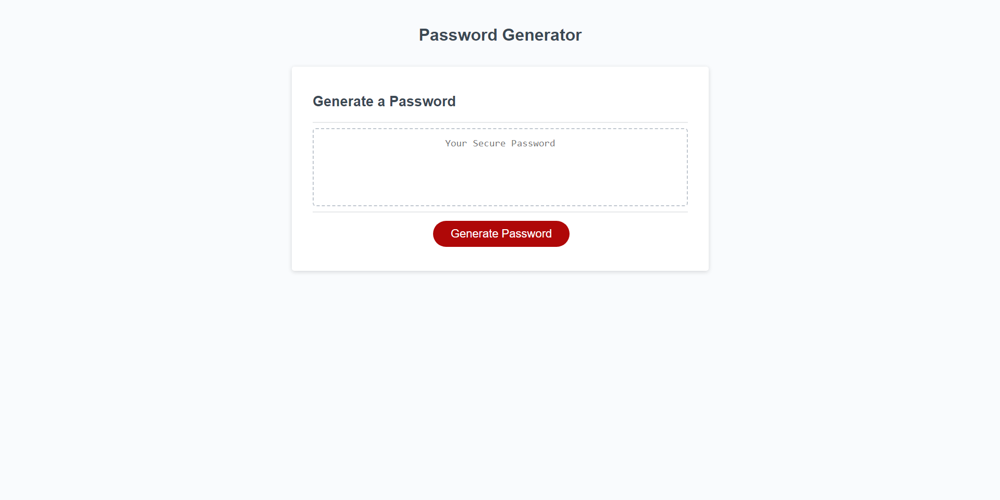
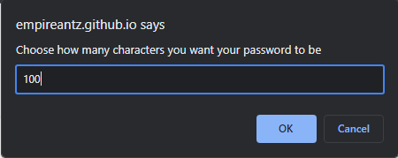
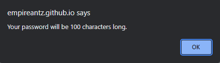
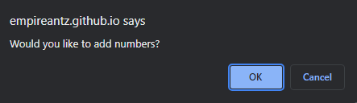
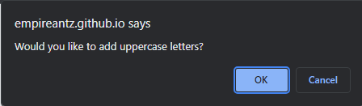
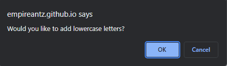
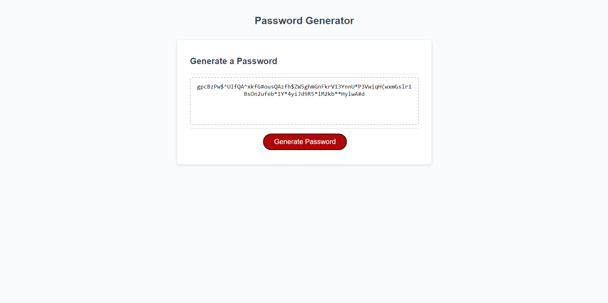

# Password Generator 

## Overview

Generates a random and seure password based on your preferences.

## Technologies Used 

- HTML: Used to create the structure of the webpage
- CSS: Used for styling and layout of the webpage
- Javascript: Used to handle all the logic of the webpage

## Features 

- Configurable password length between 8-128 characters
- Password options include:
    - Numbers 
    - Uppercase
    - Lowercase
    - Special Characters

## How to Use

1. Click the "Generate Password" button 
2. Choose the length of your password 
3. Confirm which character types you want to include in your password 
4. Your randomly generated password should now appear in the text area

## Images 

## Website Link

https://empireantz.github.io/random-password-generator/